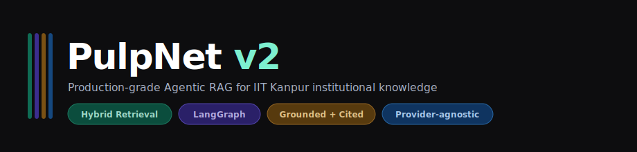
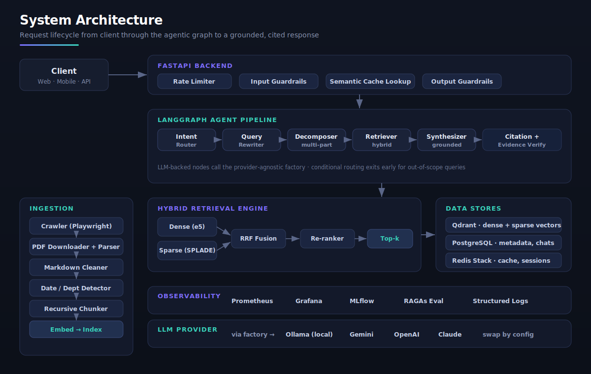
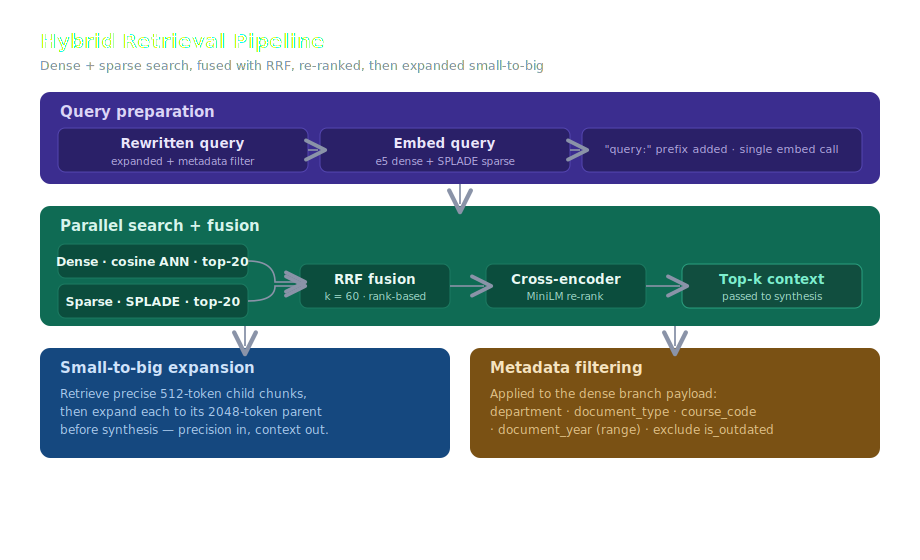
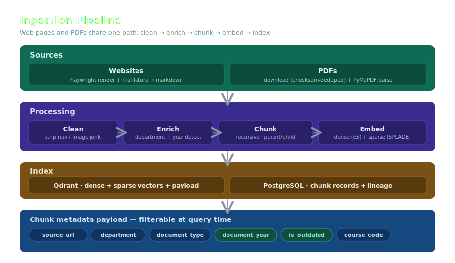

<div align="center">
  
</div>

<p align="center">
  <a href="#"></a>
  <a href="#"></a>
  <a href="#"></a>
  <a href="#"></a>
  <a href="#"></a>
</p>

---

## What is PulpNet?

PulpNet is an **agentic RAG platform** that answers questions about IIT Kanpur institutional knowledge — courses, regulations, faculty, departments, examinations, hostels, calendars, and policies — with responses that are **grounded in retrieved evidence and cited to their source**.

It is built as a production system, not a demo: provider-agnostic LLMs, hybrid retrieval, staleness-aware metadata, guardrails, semantic caching, and full observability. Every layer is modular, strongly typed, and config-driven.

> **The core promise:** never an unsourced claim. Every statement in an answer traces back to a retrieved chunk, and outdated documents are flagged rather than silently trusted.

---

## Architecture

<div align="center">
  
</div>

A request flows from the client through the FastAPI layer (rate limiting → input guardrails → semantic cache), into the LangGraph agent pipeline, down to the hybrid retrieval engine, and back out as a grounded, cited answer that passes output guardrails before it reaches the user.

---

## How retrieval works

<div align="center">
  
</div>

Retrieval runs **two searches in parallel** — dense semantic (multilingual-e5-large) and sparse lexical (SPLADE) — then fuses them with **Reciprocal Rank Fusion** so neither retriever dominates. A cross-encoder re-ranks the fused candidates by joint query-document relevance. Finally, the **small-to-big** step swaps each precise 512-token child chunk for its 2048-token parent, so the LLM synthesizes with full context while retrieval stays precise.

Metadata filters (department, document type, course code, and **document year**) apply at search time, which is how stale content can be excluded or down-weighted.

---

## How content gets in

<div align="center">
  
</div>

Web pages and PDFs converge on a **single ingestion path**. Web content is crawled with Playwright and converted to markdown by Trafilatura; PDFs are downloaded (deduplicated by checksum) and parsed with PyMuPDF. Both are then cleaned of navigation noise, enriched with detected department and publication year, chunked recursively into parent/child pairs, embedded, and indexed into Qdrant with full metadata payloads.

---

## Tech stack

| Layer | Choice | Why |
|---|---|---|
| **API** | FastAPI (async) | Native async, automatic OpenAPI docs, dependency injection |
| **Orchestration** | LangGraph | Conditional, branching agentic workflow with typed state |
| **LLM** | Ollama (local) via provider-agnostic factory | Swap to Gemini / OpenAI / Claude by config only |
| **Vector store** | Qdrant | Native dense **and** sparse vectors in one collection |
| **Dense embeddings** | `intfloat/multilingual-e5-large` (1024-d) | Multilingual — handles English + Hindi IITK content |
| **Sparse embeddings** | `prithivida/Splade_PP_en_v1` | Learned lexical sparse vectors for hybrid retrieval |
| **Re-ranker** | `cross-encoder/ms-marco-MiniLM-L-6-v2` | Joint query-document scoring (baseline; fine-tune later) |
| **Relational store** | PostgreSQL + SQLAlchemy (async) | Documents, chunks, crawl history, chats, feedback |
| **Cache / queue** | Redis Stack | Semantic cache (vector search), sessions, rate limiting |
| **Guardrails** | LLM safety classifier + Presidio | Injection/jailbreak detection + PII redaction |
| **Chunking** | Recursive, token-bounded (tiktoken) | Structure-aware parent/child splitting |
| **Observability** | Prometheus · Grafana · MLflow · RAGAs | Metrics, dashboards, experiment tracking, RAG eval |
| **Tooling** | uv · Ruff · Black · MyPy · pytest | Fast installs, strict typing, full lint/test surface |

---

## Quick start

### Prerequisites

- Python 3.12, [`uv`](https://github.com/astral-sh/uv), Docker + Docker Compose
- [Ollama](https://ollama.com) running locally (`ollama serve`) with a pulled model
- Chromium (for Playwright crawling)

### Setup

```bash
# 1. Install dependencies (also installs pre-commit hooks + Playwright Chromium)
make install-dev

# 2. Configure environment
cp .env.example .env
#    then edit .env — at minimum set LLM_PROVIDER and CRAWLER_CHROMIUM_PATH

# 3. Start infrastructure (Postgres, Redis Stack, Qdrant)
make infra-up

# 4. Apply database migrations
make migrate

# 5. Pull a local model for Ollama
ollama pull gemma2:9b
```

### Ingest IITK content

```bash
# Crawl all registered sources, download + parse PDFs, chunk, embed, index
uv run python -m pulpnet.ingestion.pipeline.runner

# Or a single ad-hoc URL
uv run python -m pulpnet.ingestion.pipeline.runner --url https://www.iitk.ac.in/doaa/
```

### Run the API

```bash
make api          # http://localhost:8000  (docs at /docs)
```

```bash
# Ask a question
curl -X POST http://localhost:8000/api/v1/chat \
  -H "Content-Type: application/json" \
  -d '{"query": "What does the Dean of Academic Affairs handle at IITK?"}'
```

---

## Configuration

All settings live in `.env` and are loaded through typed Pydantic v2 models (`src/pulpnet/config/settings.py`). Nothing is hard-coded. Key groups:

```ini
# LLM — swap providers without touching code
LLM_PROVIDER=local            # local | google | openai | anthropic
LLM_MODEL=gemma2:9b

# Embeddings & retrieval
EMBEDDING_MODEL=intfloat/multilingual-e5-large
RETRIEVAL_FINAL_TOP_K=5
RETRIEVAL_RRF_K=60

# Chunking (token budgets)
CHUNK_SIZE=512                # child chunk
CHUNK_PARENT_SIZE=2048        # parent chunk

# Semantic cache
SEMANTIC_CACHE_THRESHOLD=0.92
SEMANTIC_CACHE_TTL=3600

# Guardrails
PII_REDACTION_ENABLED=true
GUARDRAILS_TOPIC_RESTRICTION=true
```

> **Model weights** are cached to a local `./.models` directory (configured in `src/pulpnet/bootstrap.py`), never to your home folder.

---

## Adding sources

Sources are a config list, not code. Append an entry to `IITK_SOURCES` in `src/pulpnet/config/sources.py`:

```python
CrawlSource(
    name="Department of Mathematics",
    start_url="https://www.iitk.ac.in/math/",
    max_depth=2,
    max_pages=120,
    department_hint=Department.MATH,
)
```

Then re-run the ingestion runner. New pages are detected by checksum; unchanged pages are skipped, changed pages are re-indexed.

---

## Staleness handling

IITK documents — especially PDFs — are often years out of date. PulpNet extracts each document's **own** publication year (from URL patterns, academic-year ranges, and effective-date phrases in the text) and stores it as filterable metadata.

```python
# Retrieve only recent material
await retriever.retrieve(query, metadata_filter={"document_year": {"gte": 2022}})

# Or exclude flagged-outdated content
await retriever.retrieve(query, metadata_filter={"is_outdated": False})
```

The **recommended** default is *soft-flagging* rather than hard exclusion: outdated chunks are still retrievable but marked in the synthesis prompt, so the model warns the user instead of silently dropping a possibly-relevant source.

---

## Project layout

```
src/pulpnet/
├── api/              # FastAPI app, routes, middleware
├── agents/           # LangGraph nodes, state, graph builder
├── retrieval/        # hybrid retriever, RRF, cross-encoder reranker
├── embeddings/       # dense + sparse embedding service
├── vectorstore/      # Qdrant service (collections, search, payload indexes)
├── database/         # SQLAlchemy models, repositories, Alembic migrations
├── ingestion/
│   ├── crawler/      # Playwright web crawler
│   ├── parsers/      # PDF, markdown cleaner, date + department detectors
│   ├── chunking/     # recursive parent/child chunker
│   └── pipeline/     # crawl → pdf → chunk → embed runners
├── cache/            # Redis client, semantic cache, rate limiter
├── guardrails/       # LLM safety classifier, Presidio PII redaction
├── services/         # LLM factory, chat service (business logic)
├── config/           # typed settings, source registry
├── schemas/          # Pydantic models (documents, API)
└── bootstrap.py      # local model-cache configuration
```

Business logic never lives in routes — routes delegate to services, services use repositories, repositories own all database access.

---

## Development

```bash
make lint          # Ruff
make format        # Black + Ruff format
make typecheck     # MyPy (strict)
make test-unit     # fast unit tests
make test-integration   # tests against live services
```

---

## Build status

PulpNet is built milestone by milestone, each verified before the next.

| # | Milestone | Status |
|---|---|---|
| 1 | Project initialization · typed config · schemas | ✅ |
| 2 | Web crawler + PostgreSQL persistence | ✅ |
| 3 | Recursive parent/child chunking | ✅ |
| 4 | Dense + sparse embeddings → Qdrant | ✅ |
| 5 | Hybrid retrieval (RRF + cross-encoder) | ✅ |
| 6 | LangGraph agent pipeline | ✅ |
| 7 | FastAPI backend · `/chat` endpoint | ✅ |
| 8 | PDF ingestion (download + parse) | ✅ |
| — | Markdown cleaning + date/year extraction | ✅ |
| — | Guardrails (LLM safety + Presidio PII) | ✅ |
| — | Redis semantic cache + rate limiting | ✅ |
| 9 | RAGAs evaluation + MLflow tracking | 🔜 planned |
| 10 | Deployment hardening · CI/CD gate | 🔜 planned |

---

## Evaluation approach

PulpNet uses a **reference-free-first** evaluation strategy so it can be measured without a hand-labeled QA set:

- **Day one:** Faithfulness, Answer Relevancy, Context Precision (no ground truth needed)
- **Retrieval tuning:** round-trip evaluation — generate a question from a chunk, confirm that chunk is retrieved
- **At corpus build:** RAGAs `TestsetGenerator` synthesizes a QA set from the corpus, evaluated with a *different* model than the one that generated it
- **Post-launch:** user feedback and pairwise LLM-as-judge for regression gating

---

## Design principles

PulpNet follows a few non-negotiable rules:

- **Grounded or nothing** — no answer without retrieved evidence; "I couldn't find this" beats a hallucination.
- **Provider-agnostic** — the LLM is an injected dependency; swapping providers is a config change.
- **Typed end to end** — Pydantic v2 schemas and MyPy strict throughout.
- **Separation of concerns** — routes → services → repositories, with no business logic in the API layer.
- **Config over code** — sources, models, thresholds, and budgets are all declarative.

---

<div align="center">
  <sub>Built as a Staff-ML-Engineer-grade reference for institutional RAG. MIT licensed.</sub>
</div>
